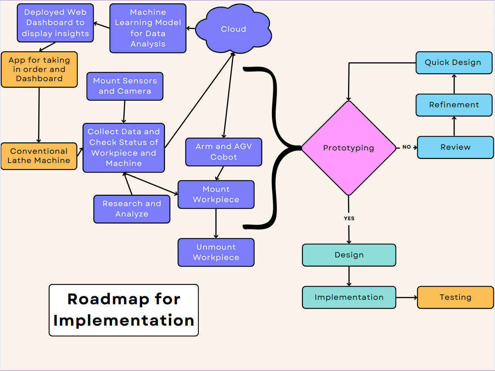

# Logs and Updates

Discussion with team regarding idea - Making a Smart Automatic Lathe Machine (2300 hrs October 20, 2022)

## Roadmap for Implementation

### Technologies and Hardware to be Used

1. Google Cloud
2. Firebase
3. Flutter
4. Android App Development (Java)
5. Machine Learning and Deep Learning
6. IIoT
7. Edge Devices
8. Cobots (Arm and AGV)
9. Web development
10. Raspberry Pi
11. Arduino
12. Servo Motor
13. Stepper Motor
14. 3D Printer
15. SolidWorks
16. Conventional Lathe Machine
17. Camera
18. Computer Vision

## Tasks assigned